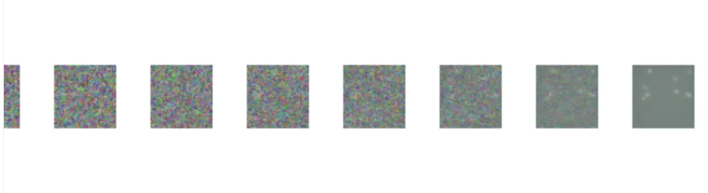

# Diffusion Model
Please refer my medium blog for detail understanding of Architecture : https://medium.com/@annemsony/introduction-to-diffusion-models-56becd6e5c1d.

This repository contains an implementation of a diffusion model for generating images and denoising corrupted images. Diffusion models are powerful generative models that learn to reverse a diffusion process to create high-quality data from noise.

---

## Table of Contents

- [Introduction to Diffusion Models](#introduction-to-diffusion-models)
- [Basic Concepts](#basic-concepts)
  - [Diffusion Process](#diffusion-process)
  - [Gaussian Noise](#gaussian-noise)
- [Mathematical Formulation](#mathematical-formulation)
  - [Forward Process](#forward-process)
  - [Reverse Process](#reverse-process)
- [Model Architecture](#model-architecture)
- [Training and Inference](#training-and-inference)
  - [Training](#training)
  - [Inference](#inference)
- [Applications](#applications)
- [Summary](#summary)
- [References](#references)

---

## Introduction to Diffusion Models

Diffusion models are a type of generative model that learns to reverse a diffusion process to generate data. They are particularly known for their ability to produce high-quality images and are used in various generative tasks.

---

## Basic Concepts

### Diffusion Process

The diffusion process involves adding noise to data in a series of steps, gradually transforming the data into pure noise. This process can be described as:

1. **Forward Diffusion Process**:
   - Starts with clean data and progressively adds Gaussian noise over multiple steps.
   - The data becomes increasingly noisy with each step.

2. **Reverse Diffusion Process**:
   - Aims to reverse the noise addition by learning a model to predict and remove noise.
   - This process reconstructs the data from the noisy version.

### Gaussian Noise

Gaussian noise is characterized by:
- **Mean ($\mu$)**: Average value of the noise, typically set to zero.
- **Variance ($\sigma^2$)**: Measures the spread of the noise values. Increases during the forward process and decreases in the reverse process.

---

## Mathematical Formulation

### Forward Process

The forward process is defined as:

$$
x_t = \sqrt{1 - \beta_t} \cdot x_{t-1} + \sqrt{\beta_t} \cdot \epsilon_t
$$

Where:
- $x_t$: Noisy image at step $t$.
- $\beta_t$: Noise schedule.
- $\epsilon_t$: Gaussian noise with mean $0$ and variance $\sigma_t^2$.

### Reverse Process

The reverse process is modeled as:

$$
p_\theta(x_{t-1} | x_t)
$$

Where $\theta$ represents the parameters of the neural network model that learns to predict and remove the noise.

---

## Model Architecture

Diffusion models often use architectures such as **U-Net** or **transformers** to model the reverse process. These architectures help capture complex relationships between noisy and clean data and accurately predict noise across different diffusion steps.

---

## Training and Inference

### Training

- The model is trained by minimizing the difference between the predicted noise and the actual noise used in the forward process.
- This involves optimizing a **loss function** that measures reconstruction error.

### Inference

- At inference time, the model generates new data by starting from random noise and applying the learned reverse process to gradually denoise it.

---

## Applications

Diffusion models are applied in various domains, including:

- **Image Synthesis**: Generating high-quality images from random noise.
- **Image Denoising**: Restoring images corrupted by noise.
- **Image Inpainting**: Filling in missing or corrupted parts of images.
- **Style Transfer**: Transferring styles between images while preserving content.

---

## Summary

Diffusion models use the principles of diffusion processes and neural networks to generate and restore images. By understanding and reversing the diffusion process, these models provide powerful tools for various generative tasks.

---

## References

For more details, please refer to this article on [Medium](https://medium.com/@annemsony).

